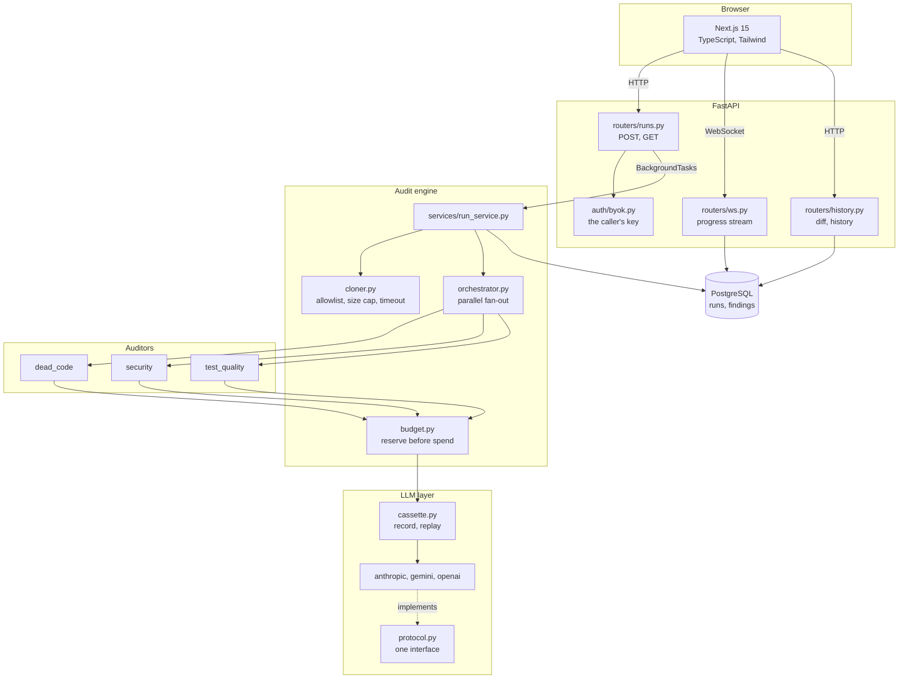
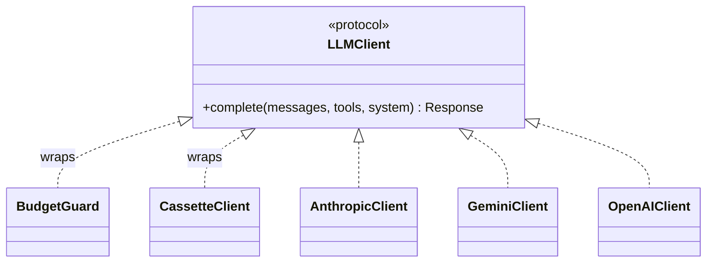
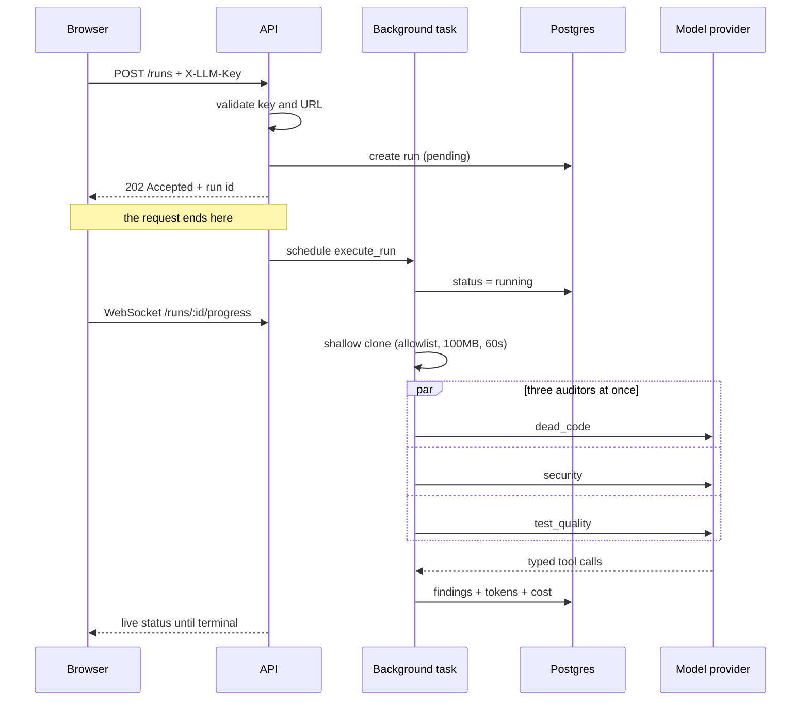
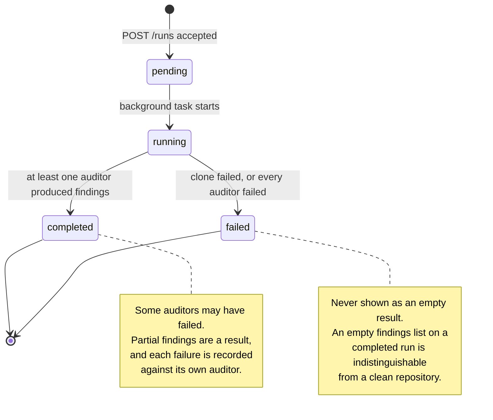

# repo-radar

**A multi-agent code auditing service that can prove it did not get worse.**

Submit a public Git repository. Specialised auditor agents read it in parallel,
report findings through typed tool schemas, and stop at a spending ceiling. Run
it twice and the second run tells you what changed.

[](https://www.python.org/)
[](https://fastapi.tiangolo.com/)
[](https://nextjs.org/)
[](#verification)
[](#verification)
[](#verification)
[](LICENSE)
[](CHANGELOG.md)

---

## Contents

- [Why this exists](#why-this-exists)
- [Demo](#demo)
- [What makes it different](#what-makes-it-different)
- [Architecture](#architecture)
- [How a run works](#how-a-run-works)
- [Quick start](#quick-start)
- [Using it](#using-it)
- [The evaluation harness](#the-evaluation-harness)
- [Design decisions](#design-decisions)
- [Project structure](#project-structure)
- [Verification](#verification)
- [Known limitations](#known-limitations)
- [License](#license)

**Further reading:** [ROADMAP.md](ROADMAP.md) · [CHANGELOG.md](CHANGELOG.md) ·
[docs/EVALUATION.md](docs/EVALUATION.md) · [SECURITY.md](SECURITY.md) ·
[CONTRIBUTING.md](CONTRIBUTING.md) · [AGENTS.md](AGENTS.md)

---

## Why this exists

Automated code audits are easy to generate and hard to trust. Ten AI-generated
audit reports of one repository, all produced on the same day, ended with the
same admission:

> A comparable previous audit is unavailable; this result becomes the baseline.

None of them could compare a repository against its own history, so none could
answer the only question that matters after the first read: **did this get better
or worse?**

repo-radar answers that. It also holds itself to the standard it measures: every
auditor is scored against fixture repositories with deliberately planted defects,
and a prompt change that degrades detection fails the build.

## Demo

<!--
  To add the walkthrough: drag the video file into a GitHub issue or PR comment,
  copy the URL GitHub generates, and replace the placeholder below with:

      https://github.com/user-attachments/assets/<id>

  A bare URL on its own line renders as an inline player. Keep it under 10MB.
-->

> **Video walkthrough:** _recording pending_ — submitting a repository, watching
> the auditors run, reading the findings, and running it a second time to see the
> diff.

There is no hosted demo on purpose. The service uses **bring your own key**, so a
public instance would ask visitors to paste their own model credentials into
someone else's website. Running it locally takes about two minutes; see
[Quick start](#quick-start).

A real run, for scale:

```
repository  https://github.com/Elmirbek182/SOLID   (Java, Spring)
model       gemini-flash-latest
tokens      30,001 in / 352 out
cost        $0.0099
findings    3

  medium  test_quality  assertion_free_test     ApplicationTests.java
          The contextLoads test executes without asserting any expectations.
  high    test_quality  untested_critical_path  PaymentProcessor.java
  high    test_quality  untested_critical_path  PaymentProcess.java
```

## What makes it different

Most "AI code review" projects stop at calling a model in a loop. The parts that
take real work are the ones around the model:

| | How it is handled |
| --- | --- |
| **Regression-proof prompts** | Golden fixture repositories with planted defects. Precision and recall asserted in CI. A prompt edit that detects less fails the build. |
| **Deterministic tests** | Real model replies recorded once as cassettes, replayed forever. The suite runs offline, free, and cannot flake on model non-determinism. |
| **Cost control** | Every call is priced before it is made and charged against a per-run ceiling. Concurrent auditors cannot collectively slip past it. |
| **Typed output** | Findings arrive through tool schemas derived from the Pydantic model. Nothing is parsed out of prose. |
| **Provider portability** | Anthropic, Gemini and OpenAI behind one protocol. The provider is chosen from the shape of the key. |
| **History** | Every run is stored and compared against the previous one: new, fixed, or still there. |

## Architecture



**The layering that matters:** `orchestrator → budget → cassette → provider` are
all the same one-method interface. Each can stand in for the others, which is why
adding a provider is a new file rather than an edit, and why the budget guard and
the cassette layer do not know the other exists.



## How a run works



The key never reaches the database. It arrives in a header, lives in memory for
the length of the run, and is gone.

### Run states



## Quick start

**Requirements:** Python 3.11+, Node 20+, Docker, and an API key from
[Anthropic](https://console.anthropic.com/),
[Google AI Studio](https://aistudio.google.com/apikey) or
[OpenAI](https://platform.openai.com/api-keys).

```bash
make install    # dependencies, database, migrations
make dev        # backend and frontend with hot reload
```

`make` on its own lists every target. Without make:

```bash
docker compose up -d                                    # database
cd backend && uv sync --extra dev && .venv/bin/alembic upgrade head
.venv/bin/uvicorn app.main:app --reload --port 8001
cd ../frontend && npm install && npm run dev
```

Open <http://localhost:3000>, paste your key, submit a repository.

**Or run the whole stack in containers:**

```bash
make up
```

Migrations run on boot, the backend runs as a non-root user, and cloned
repositories land on a `tmpfs` that is discarded with the container.

You do **not** need a key to run the tests. They replay recorded cassettes:

```bash
cd backend && .venv/bin/pytest -q      # 166 passed, no network, no cost
```

## Using it

### Through the browser

| Page | What it shows |
| --- | --- |
| `/` | Submit a repository and your key |
| `/runs/{id}` | Live progress, tokens, cost, findings |
| `/repos/{slug}` | Every run of that repository, and what the latest one changed |

### Through the API

```bash
# start a run
curl -X POST localhost:8001/api/v1/runs \
  -H 'Content-Type: application/json' \
  -H 'X-LLM-Key: sk-ant-...' \
  -d '{"repository_url": "https://github.com/psf/requests", "max_usd": "0.50"}'

# poll it (no key needed: a run holds no secrets)
curl localhost:8001/api/v1/runs/{id}

# what changed since the previous run
curl localhost:8001/api/v1/runs/{id}/diff

# every run of one repository
curl localhost:8001/api/v1/repos/github.com/psf/requests/history
```

Interactive docs at <http://localhost:8001/docs>.

### The auditors

| Auditor | Looks for |
| --- | --- |
| `dead_code` | unused modules, unreferenced assets, commented-out implementations |
| `security` | hardcoded credentials, injection risk, unsafe deserialization, missing authorisation |
| `test_quality` | assertion-free tests, disabled tests, tautological assertions, untested critical paths |

Adding one is a prompt, a tool description, and a fixture. Everything else is
shared.

## The evaluation harness

This is the part worth reading. Full detail in
[docs/EVALUATION.md](docs/EVALUATION.md).

Each auditor is scored against small repositories carrying deliberately planted
defects, plus correct code doing the same job. Without that correct code
alongside, precision would be meaningless: an auditor that flagged every line
would score perfectly.

**Measured, not asserted:**

| Auditor | Fixture | Precision | Recall |
| --- | --- | ---: | ---: |
| `dead_code` | `repo_a` | 1.00 | 1.00 |
| `security` | `repo_b` | 1.00 | 1.00 |
| `test_quality` | `repo_b` | 1.00 | 1.00 |

Findings are matched on category and file path, never on wording. A model
rephrases the same defect every run, so scoring prose would measure writing
rather than detection.

A separate test names the files that must **never** be reported: the live code
path, and the correctly-written credential handling. Precision alone would let a
false positive through if the auditor also found enough real defects.

Two fixtures with unambiguous defects is a real measurement but a small one.
1.00 says the prompts work on clear cases; it does not predict messy real
repositories. The value is the ratchet: **if a prompt edit degrades detection, CI
fails.**

## Design decisions

<details>
<summary><b>Cassettes instead of live model calls in tests</b></summary>

Agent tests that hit a live model are slow, paid, and non-deterministic. Real
replies are recorded once into JSON, then replayed forever.

The cassette key hashes the model, system prompt, messages and tool schemas, so
an edited prompt **misses** the cassette rather than quietly replaying an answer
to the previous question. A miss raises: falling back to the network would
reintroduce every problem cassettes exist to remove.
</details>

<details>
<summary><b>Cost is reserved before a call, not counted after</b></summary>

The first version checked only money already spent. Since every auditor makes one
call, all three were admitted before any had reported a cost — the ceiling could
never fire. A live run spent **$0.60 against a $0.25 ceiling** and reported itself
clean.

Now each call is priced from its prompt and tool schemas and held as a
reservation until the reply lands, so the reservation is visible to every other
auditor before any of them is admitted.

Enforcement is against estimates, not a hard cap. Input is estimated closely
because we build the prompt; output is assumed generously, because under-reserving
lets a run escape while over-reserving only stops it early.
</details>

<details>
<summary><b>Decimal for money, everywhere</b></summary>

Costs are summed across thousands of calls and compared against a ceiling. Float
rounding would make that ceiling quietly wrong. Cassettes serialise cost as a
string for the same reason, with a test asserting the round trip.

An unpriced model raises rather than costing zero — a zero-cost model would let a
run bypass its budget entirely.
</details>

<details>
<summary><b>A failed run is never reported as clean</b></summary>

A run where *some* auditors failed still completes: partial findings are a result.
A run where **every** auditor failed is marked failed.

Reporting the latter as completed with an empty findings list is indistinguishable
from a clean repository, which is the worst thing an audit tool can do: say
nothing is wrong when it never managed to look. This is guarded in both the
database layer and the UI, because it appeared in both.
</details>

<details>
<summary><b>Finding identity excludes line numbers and wording</b></summary>

Two findings across two runs are the same finding when their auditor, category
and file path match.

Adding an import above a defect shifts every line below it. A model rephrases the
same defect every run. Keying on either would report churn that never happened —
and a diff that cries wolf every run is one nobody reads.
</details>

<details>
<summary><b>The repository URL is untrusted input</b></summary>

Every limit in `cloner.py` exists because someone can submit any URL. Full threat
model in [SECURITY.md](SECURITY.md):

- **https only** — `file://` would read the server's disk, `ssh://` would use the
  server's keys, `git://` skips host verification
- **host allowlist** — which also blocks `169.254.169.254`, the cloud metadata endpoint
- **no embedded credentials** — those end up in logs
- **`--recurse-submodules=no`** — submodules fetch URLs that never passed the host check
- **timeout, 100MB cap, cleanup in a `finally`** — a failed audit cannot fill the disk
- **symlinks skipped when measuring size** — following one would both mis-count and
  read outside the workspace

Each has a test.
</details>

<details>
<summary><b>No Redis</b></summary>

Background work runs through FastAPI `BackgroundTasks`; run state lives in
Postgres. Nothing has needed a queue or a shared cache.

A Redis that did nothing would be cargo-cult infrastructure. It gets added when
concurrent runs measurably outgrow a single process, with the measurement that
justified it.
</details>

<details>
<summary><b>No shadcn/ui</b></summary>

The UI needs a table, badges, an input and a button — all trivial in Tailwind.
shadcn earns its place on dialogs, comboboxes and focus management, none of which
exist here. Adding a CLI, a config file and Radix dependencies for four
primitives is exactly the unused surface the `dead_code` auditor is built to find.
</details>

## Project structure

```
backend/
  app/
    auditors/          one module per auditor: prompt + tool description
    llm/               protocol, cassettes, cost accounting
      providers/       anthropic · gemini · openai + key-based selection
    routers/           HTTP and WebSocket handlers (thin: no business logic)
    services/          business logic
    repositories/      database queries
    models/            SQLAlchemy ORM
    schemas/           Pydantic request and response models
    cloner.py          safe clone of an untrusted URL
    orchestrator.py    parallel fan-out, outcome merging
    budget.py          per-run spending ceiling
    evaluation.py      precision and recall
  tests/
    fixtures/          repositories with planted defects + golden.json
    cassettes/         recorded model replies (generated)
    eval/              the regression gate
  alembic/             migrations
frontend/
  src/app/             App Router pages
  src/components/      findings table, badges, run stats
  src/lib/             API client, websocket hook
```

## Verification

CI runs exactly these commands.

```bash
make check      # lint, typecheck and test, both sides
make audit      # known vulnerabilities in dependencies
```

Individually:

```bash
cd backend
.venv/bin/ruff check . && .venv/bin/ruff format --check .
.venv/bin/mypy app            # strict
.venv/bin/pytest -q --cov=app # 197 passed, 95% covered

cd ../frontend
npm run lint && npm run typecheck && npm run build
```

Tests open no sockets and need no database: they call the app in process through
`ASGITransport` and use in-memory SQLite, which is why CI needs no services.

**Re-recording cassettes** — only needed when a prompt, tool schema or model
changes:

```bash
cd backend
GEMINI_API_KEY=... .venv/bin/python scripts/record_cassettes.py
```

## Known limitations

Stated plainly, because a tool that measures honesty should be honest.

- **No authentication.** Runs are rate limited per caller, but there are no
  accounts: anyone with a run id can read it. See [SECURITY.md](SECURITY.md) for
  the full list of what is and is not defended.
- **The rate limiter is per process.** N workers allow N times the limit. It moves
  to shared state when the job queue arrives; see [ROADMAP.md](ROADMAP.md).
- **Prices are hardcoded and will drift.** `usage.py` carries a price table that
  is an estimate, not a quote. A wrong price makes the ceiling wrong by the same
  factor.
- **The evaluation is small.** Two fixtures, unambiguous defects. It catches
  regressions; it does not predict behaviour on large messy repositories.
- **Two findings of the same category in one file count as one** for diffing.
  Fine while categories are file-level.
- **The websocket polls Postgres once a second** rather than subscribing. It
  survives multiple workers, which an in-memory subscription would not, but it is
  not instant.
- **Findings are not deduplicated across auditors.** Two auditors noticing the
  same problem report it twice.

## License

MIT. See [LICENSE](LICENSE).
